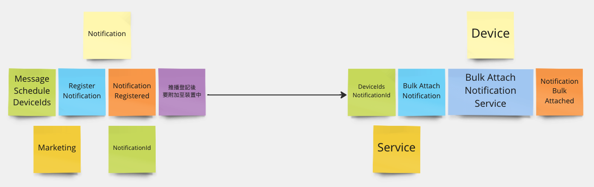
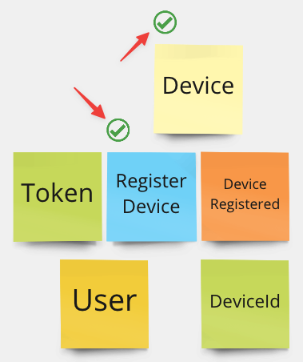

# 專案開發流程(Clean Architecture) My Way
---
這邊雖然是掛著Clean Architecture，但更多的是參考[Explicit Architecture](https://herbertograca.com/2017/11/16/explicit-architecture-01-ddd-hexagonal-onion-clean-cqrs-how-i-put-it-all-together/)的設計。

常見的Hexagonal Architecture、Onion Architecture、Clean Architecture儘管著重的重點有些不同，但概念上是相同的。
在設計規劃上，會使用Event Storming的藍圖來協助進行專案的實作，其優點是Event Storming中的元素內容，能夠很好的貼合專案實作的內容(In-Code)。
## 規劃
> ***Plans are worthless, but planning is everything.***
> 
Eisenhower

首先延續在Lite版本中Modeling階段的結果，為Domain Model中的Aggregate加入Event Storming裡Domain Event的便利貼元素，如下所示：

接著將Domain Model的Method與Domain Event，照著DST中的Sequence Number，排列成Event Storming的形式，如下所示：

從左到右是時間流(Time Flow)的方向，且分成上下兩個區塊，上面是Command、下面是Query。
#### Domain Service
在Review的過程中，可能會發現有些Command Block不是很應景。

以上圖為例，推播登記通常不會只包含一個Device，Notification Registered Domain Event後續Policy衍伸的Attach Notification Command可以收攏成Bulk的命令形式，操作多個Device Aggregate進行Attach Notification的動作，可以藉由Domain Service來協助達成。

這邊會發現在Event Storming的藍圖中，Notification Bulk Attached Domain Event取代了Notification Attached Domain Event，但在Domain Model中只有Notification Attached Domain Event的規劃。
所以可以區分一下，Notification Attached Domain Event會由Aggregate生成，Notification Bulk Attached Domain Event會由Domain Service生成，而實作上可以將Notification Attached Domain Event放進Notification Bulk Attached Domain Event當中。

#### Application Service

接著可能會發現有些Command Block可能會涉及到外部的IO來協助。

以上圖為例，Push Notification的動作會需要FCM/APNs等外部的資源來協助進行推播的發送服務，可以加入對應的Application Service來表示。
**注意，實作上Domain Event依舊是透過Aggregate來產生。**

整理過後會如下圖所示：

## 實作
在Lite版本中，Aggregate的Method在執行過後沒有Domain Event的概念，這邊需要額外加進Domain Event的驗證。

~~

Domain Service屬於Domain Layer的一部分，會在Domain這個資料夾底下建立對應的測試

~~

Command的屬於Application Layer的一部分，會在Application這個資料夾底下建立對應的測試。
測試中會帶入測試替身(Mock)的物件，其主要原因是Command會開始與Db進行IO的動作，這邊會透過IRepository的方式來作為與Db的Interface，而Mock就是在模擬與Db的互動。

Command的實作內容與Lite版本中提到的差不多，不外乎是
- 操作Domain Model(Aggregate)的生成方法
- 進行Repository的Add
- 發佈Domain Event

- 取出Domain Model(Aggregate)
- 操作Domain Model(Aggregate)
- 進行Repository的Save/Remove
- 發佈Domain Event

相比與Lite版本Process Flow的內容，這邊會更專注在自身Command Block中聚焦的流程動作。

~~

在完成某項實作時，通常我的習慣會在對應的便利貼上加上Done的icon，來表示這個部分已經實作完成。

~~

在完成Aggregate與Command的內容後，Event Storming還有Policy的元素。在實作上會用Domain Event Handler來表示，Domain Event Handler會放在要觸發的Command資料夾下。

具體內容很簡單，就是依據Policy列的敘述來呼叫Command而已。
**有時候會有流程上的判斷寫在Domain Event Handler當中。**

## 基礎設施
相較於Lite的版本，CA版本中的Infrastructure會加入更多的內容，DbContext更複雜的操作、Readonly的DbContext、EventMediator的實作內容與Pipeline Behavior、Repository的實作內容、Application Service的實作內容..等。

如上所示，再麻煩詳讀一下程式碼，這便就不再一一列出實作細節。

## 應用
首先在Configure Services中會加入對Readonly DbContext的註冊

在Controller的實作中，Lite版本的Process Flow在CA版本中都封裝成了Command，所以只需考慮怎麼將DTO轉換成Command即可。

~~

Query的部分不需要特別撰寫Unit Test，Query的宣告寫在Application Layer，實作寫在Infrastructure Layer。行為模式上與Command、Command Handler一樣。

---

CA的版本相較於Lite的版本其實更為繁瑣與複雜。但開發速度上肯定是Lite版本更具有優勢。

Lite版本會讓Process Flow與App高度耦合，當有其他的App需要使用既有的Process Flow，就會出現程式碼Duplicate的狀況。
而CA版本將Process Flow封裝在Application Layer(Use Case)中，假如需要一個Schedule App，可以直接發送Application Layer中宣告的Command來執行相關的業務流程與業務邏輯。

用哪個版本來實踐取決於專案取向以及目的性，技術債可以欠，但要有合理的還債計劃。