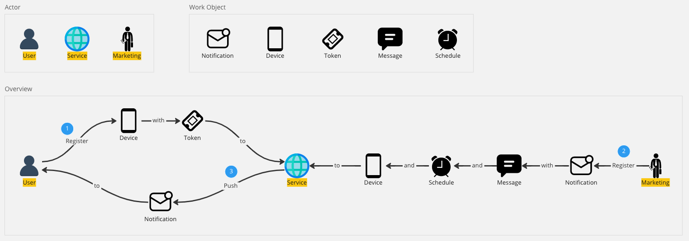
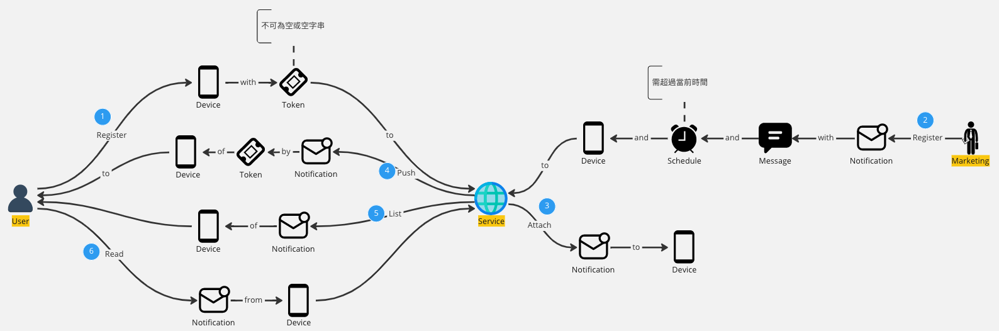
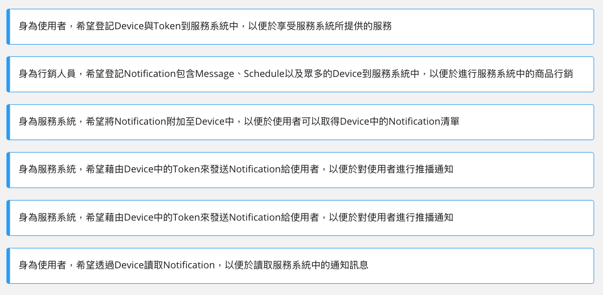
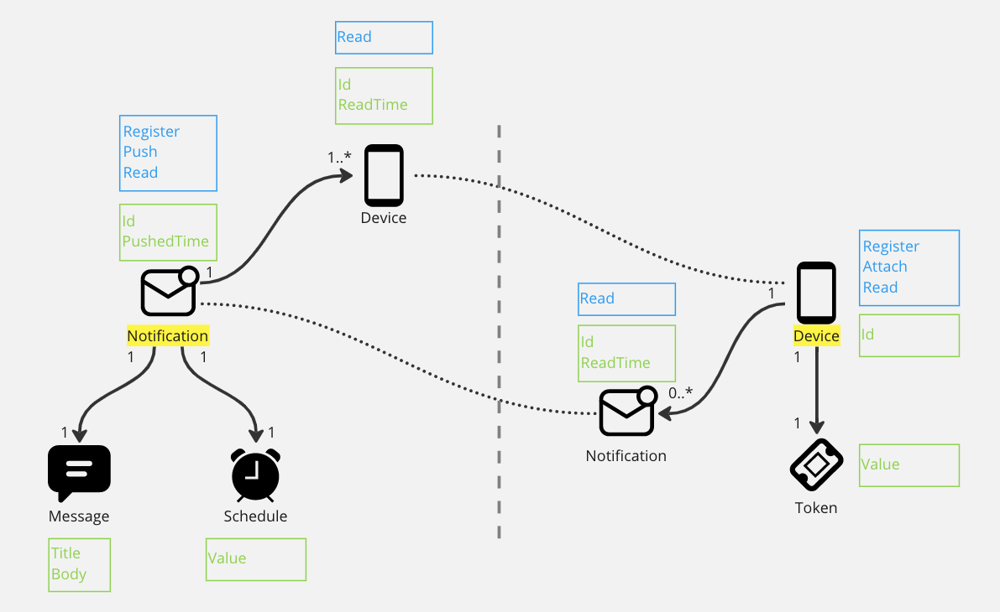

# 專案開發流程(Light) My Way

## 分析
傳統透過OOAD進行系統分析時，是透過靜態分析的方式來構築整個系統，會從需求文件或是User Story中提取主詞、動詞、受詞來設計繪製出UML、Class Diagram..等。

而近代動態分析的方式崛起，開發團隊在進行專案討論、或是個人收到系統開發需求時，可以先透過DST(領域故事敘事)或ES(事件風暴)將整個系統內容攤開。我現在偏好使用DST作為第一步的系統分析工具，由於DST不需要特別的工具使用學習，就如同說故事一般，所以與沒有相關工具使用經驗的人一同討論時，相較於使用ES進行系統分析，DST會顯得特別友善。

**Domain Storytelling(DST)主要包含以下五種元素：**
- **Actor**
    領域故事是從「演員」的角度來描述的，Actor可以是一個人、一個群體或一個軟體系統。
- **Work Object**
    參與Actor的活動，由Actor創建或使用的物件，可以表示動作中有關的資訊。
- **Activity**
    用來表達故事裡的動作行為。
- **Sequence Number**
    這數字用來表示故事裡的順序。
- **Annotation**
    任何想補充的資訊，Actor/Work Ojbect的狀態、條件表達..等, 任何想描述的都能寫在這，或者對這Activity想做的補充。

*DST有一些表達上的規則，有興趣的朋友可以自行找相關的資料進行學習。*

以下我會以一個簡單的推播需求為例子，大致上的需求內容是：
1. 使用者註冊裝置與推播Token到服務中
2. 行銷人員登記推播到服務，推播中包含訊息內文、排程時間、目標裝置..等資訊
3. 服務發送推播給使用者

以DST進行領域故事描述會以下圖所示：


當有一個Overview能夠表達此次的需求後，團隊成員可以開始討論每個Activity需不需要進行顆粒度更細的分析，像是Zoom-in拉近視角一般，畫出顆粒度更細的DST圖。

而我這邊並沒有透過Zoom-in的方式進行顆粒度更細的分析，而是另外補充系統流程中其他的動作行為，如下圖所示：
1. 使用者註冊裝置與推播Token到服務中
2. 行銷人員登記推播到服務，推播中包含訊息內文、排程時間、目標裝置..等資訊
3. 服務將推播附加至裝置當中
4. 服務依據裝置的Token發送推播給使用者
5. 服務列出裝置包含的推播訊息
6. 使用者從裝置讀取推播


此外，可以將上圖步驟中的Activity抽出來當作獨立的一個User Story看待，這些User Story可以列成Backlog作為敏捷中的Work Item，如下圖所示：


## 設計
假設系統分析已經到一個段落，就可以開始進行塑模(Modeling)的動作，可以將Work Object從DST中提取出來，連接出Work Object彼此的關係，附上Work Object需要擁有的屬性(Property)，並標記出Work Object能夠執行的方法(Method)，通常Work Object的方法會是DST中的Activity，如下圖所示：


Modeling的過程中，需要一些DDD的基本元素認識：
- **Entity** 物件有生命週期，有狀態的變化，並且必須要擁有Id這個屬性。
    1. Entity最重要的是他的Id。
    2. 兩個Entity不論其他狀態，只要Id相同就是相同的物件。
    3. 除了Id，他們其他的狀態是可變的(mutable)。
    4. 他們可能擁有很長的壽命，甚至不會被刪除。
    5. 一個Entity是可變的、長壽的，所以通常會有複雜的生命週期變化，如一套CRUD的操作。
- **Value Object** 沒有Id，且只關心它的屬性、資料。
    1. 度量或描述了領域中的某項概念，像是房子的屋齡、顏色。
    2. 不變性(Immutability)，Value Object在創建後就不能再改變了，但可以被替換掉。
    3. 將相關屬性組成一個「概念整體(Conceptual Whole)」，必須要將相關的概念整合起來，才能完整且正確地描述一件事情，如：台幣100元，台幣+100元組成一個概念整體。
- **Aggregate** 本身是一個Entity ，是當前Bounded Context中**Entity**與**Value Object**所組成的聚合物。

上圖中，我塑模成兩個主要的Aggregate，分別是推播(Notification)與裝置(Device)：
- 1個Notification(Aggregate)擁有1個Message(VO)與1個Schedule(VO)，且有1~n個Device(Entity)，Device(Entity)與Device(Aggregate)有間接關聯的關係。
- 1個Device(Aggregate)擁有1個Token(VO)，且有0~n個Notification(Entity)，Notification(Entity)與Notification(Aggregate)有間接關聯的關係。

## 實作
專案資料夾結構如下所示：
```
Project Root
└ src
  └ Architecture (基礎的架構建立與宣告)
  └ Domain
    └ Aggregates (專案的核心，Domain Model與商業邏輯封裝的地方，塑模後的Aggregate會放在這)
    └ Exceptions
    └ Services (此處代表Domain Service的存放處)
  └ Application
    └ Services (此處代表Application Service的存放處)
  └ Infrastructure
    └ EntityConfigurations (ORM的配置與設定)
  └ Migrations (生成Db Migrations的專案)
  └ WebApi
    └ Controllers (WebApi的Endpoint)
└ test
  └ UseCase.Test
    └ Domain (撰寫Domain Model的Unit Test)
    └ Services (撰寫Domain Service的Unit Test)
```