# 專案開發流程(Lite) My Way
---
## 分析
傳統透過OOAD進行系統分析時，是透過**靜態分析**的方式來構築整個系統，會從需求文件或是User Story中提取主詞、動詞、受詞來設計繪製出UML、Class Diagram..等。

近期**動態分析**的方式崛起，開發團隊在進行專案討論、或是個人收到系統開發需求時，可以先透過 **DST(領域故事敘事)** 或 **ES(事件風暴)** 將整個系統內容攤開，與Domain Expert互動的過程中繪出整個系統的脈絡。

而我現在偏好使用DST作為第一步的系統分析工具，由於DST不需要特別的工具使用學習，就如同說故事一般，與沒有相關工具使用經驗的人一同討論時，相較於使用ES進行系統分析，DST會顯得特別友善。

**Domain Storytelling(DST)主要包含以下五種元素：**
- **Actor**
    領域故事是從「演員」的角度來描述的，Actor可以是一個人、一個群體或一個軟體系統。
- **Work Object**
    參與Actor的活動，由Actor創建或使用的物件，可以表示動作中有關的資訊。
- **Activity**
    用來表達故事裡的動作行為。
- **Sequence Number**
    這數字用來表示故事裡的順序。
- **Annotation**
    任何想補充的資訊，Actor/Work Ojbect的狀態、條件表達..等，任何想描述的都能寫在這，或者對這Activity想做的補充。

*DST有一些表達上的規則，有興趣的朋友可以自行找相關的資料進行學習。*

以下我會以一個簡單的推播需求為例子，大致上的需求內容是：
1. **使用者註冊裝置與推播Token到服務中**
2. **行銷人員登記推播到服務，推播中包含訊息內文、排程時間、目標裝置..等資訊**
3. **服務發送推播給使用者**

以DST進行領域故事描述會以下圖所示：

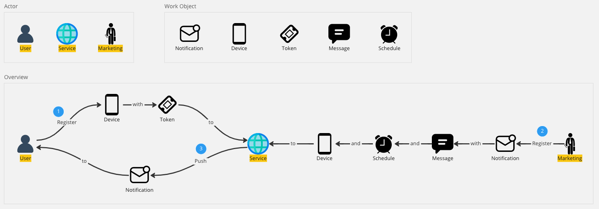

當有一個Overview能夠表達此次的需求後，團隊成員可以開始討論每個Activity需不需要進行顆粒度更細的分析，像是Zoom-in拉近視角一般，畫出顆粒度更細的DST。

- **使用者註冊裝置與推播Token到服務中：**
    Token會有不可為空或空字串的規則

    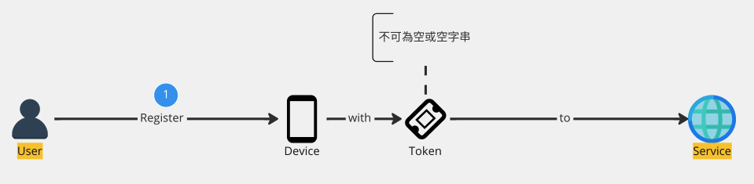

- **行銷人員登記推播到服務，推播中包含訊息內文、排程時間、目標裝置..等資訊**
    推播登記後要附加至裝置中

    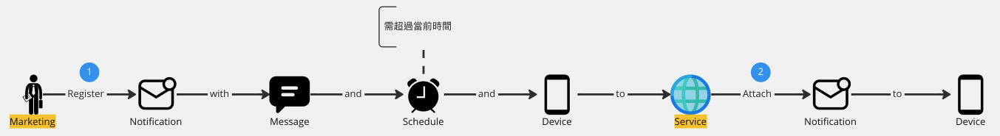

- **服務發送推播給使用者**
    1. 服務透過Device的Token發送Notification給使用者
    2. 使用者從Device讀取Notfication
    3. 服務從Notification標記Device已讀

    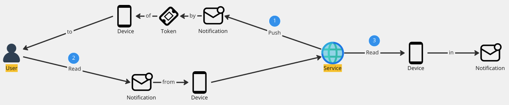

    - 可以再為**使用者從Device讀取Notfication**進行更細粒度的分析
        1. 服務列出Device中的Notification清單
        2. 使用者再從Device讀取Notification
        3. 服務從Notification標記Device已讀

        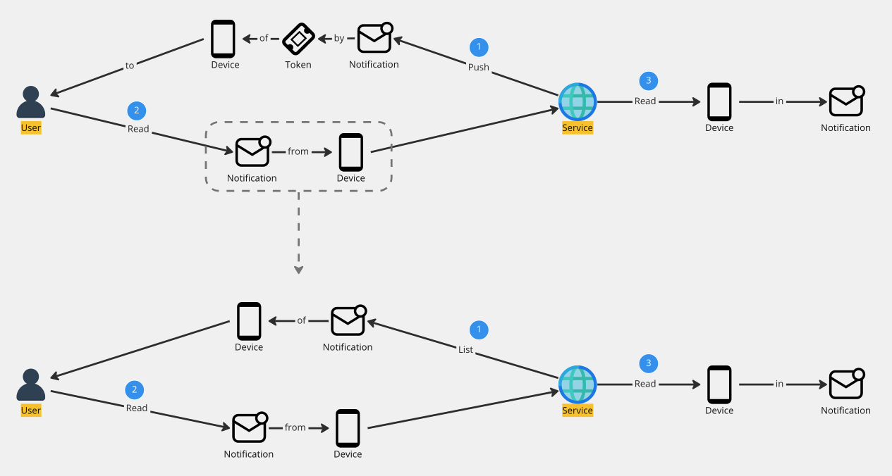

此外，可以將上述步驟中的Activity可以抽出來當作獨立的一個User Story看待，這些User Story能夠列成Backlog作為敏捷中的Work Item，如下圖所示：

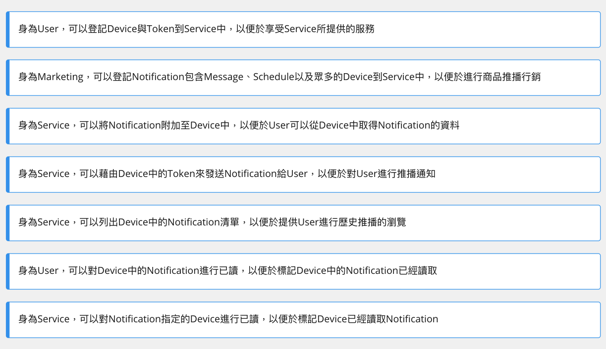

---
## 設計
這邊要一些DDD的基本元素認識：
- **Entity** 物件有生命週期，有狀態的變化，並且必須要擁有Id這個屬性。
    1. Entity最重要的是他的Id。
    2. 兩個Entity不論其他狀態，只要Id相同就是相同的物件。
    3. 除了Id，他們其他的狀態是可變的(mutable)。
    4. 他們可能擁有很長的壽命，甚至不會被刪除。
    5. 一個Entity是可變的、長壽的，所以通常會有複雜的生命週期變化，如一套CRUD的操作。
- **Value Object** 沒有Id，且只關心它的屬性、資料。
    1. 度量或描述了領域中的某項概念，像是房子的屋齡、顏色。
    2. 不變性(Immutability)，Value Object在創建後就不能再改變了，但可以被替換掉。
    3. 將相關屬性組成一個「概念整體(Conceptual Whole)」，必須要將相關的概念整合起來，才能完整且正確地描述一件事情，如：台幣100元，台幣+100元組成一個概念整體。
- **Aggregate** 是由**Entity**與**Value Object**所組成的聚合物，本身是也一個Entity。

假設系統分析已經到一個段落，就可以開始進行塑模(Modeling)的動作，首先將Work Object從DST中提取出來，連接出Work Object彼此的關係。

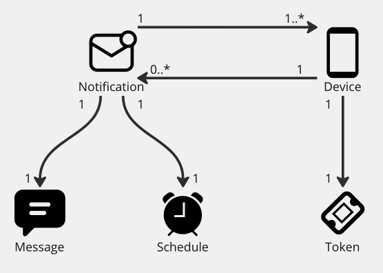

Actor直接操作的Work Object可以被歸納成Aggregate，這邊使用黃色字底標記成Aggregate。
接著附上Work Object需要擁有的屬性(Property)(綠色)，並標記出Work Object能夠執行的方法(Method)(藍色)。
通常Work Object的方法會是DST中的Activity，如下圖所示：

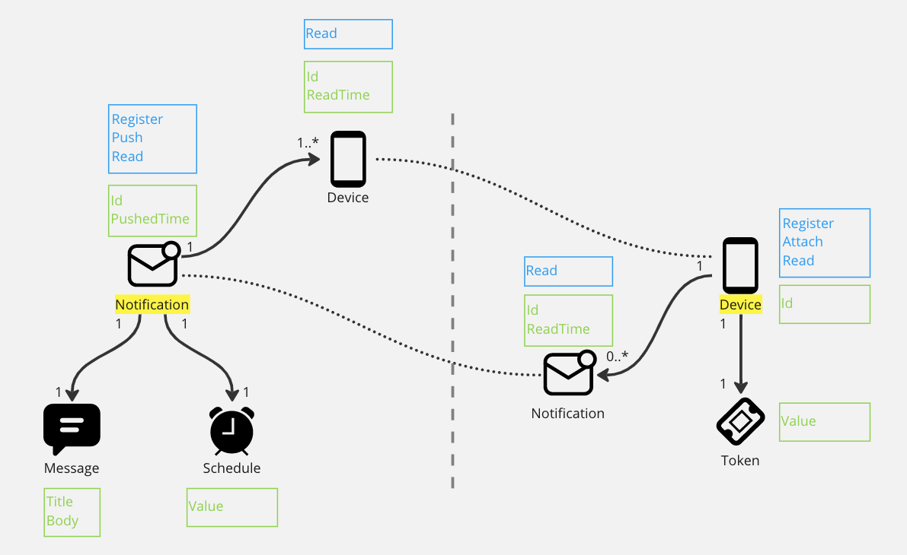

上圖中，主要塑模成兩個Aggregate，分別是 **推播(Notification)** 與 **裝置(Device)**，由於Aggregate不可在內部擁有另一個Aggregate，所以需要使用額外的Entity進行 *間接關聯* 的動作。
- 1個Notification(Aggregate)
    - 擁有1個Message(Value Object)
    - 擁有1個Schedule(Value Object)
    - 有1~n個Device(Entity)
        - Device(Entity)與Device(Aggregate)有間接關聯的關係
- 1個Device(Aggregate)
    - 擁有1個Token(Value Object)
    - 有0~n個Notification(Entity)
        - Notification(Entity)與Notification(Aggregate)有間接關聯的關係。

---
## 實作
專案資料夾結構上分為Architecture、Domain、Application、Infrastructure、App，如下所示：
```
Project Root
└ src
  └ * Architecture (基礎的架構建立與宣告)

  └ * Domain
    └ Aggregates (專案的核心，Domain Model與商業邏輯封裝的地方，塑模後的Aggregate會放在這)
    └ Exceptions
    └ Services (此處代表Domain Service的存放處)

  └ * Application
    └ Services (此處代表Application Service的存放處)

  └ * Infrastructure
    └ EntityConfigurations (ORM的配置與設定)

  └ * Migrations (生成Db Migrations的專案)

  └ * WebApi
    └ Controllers (WebApi的Endpoint)
    
└ test
  └ UseCase.Test
    └ Domain (撰寫Domain Model的Unit Test)
    └ Services (撰寫Domain Service的Unit Test)
```
#### 1. 透過TDD來實作領域模型
可以先從Value Object作為TDD開發的起手式。以Token為例子，Token的業務邏輯是「不可為空或空字串」的，如下所示：

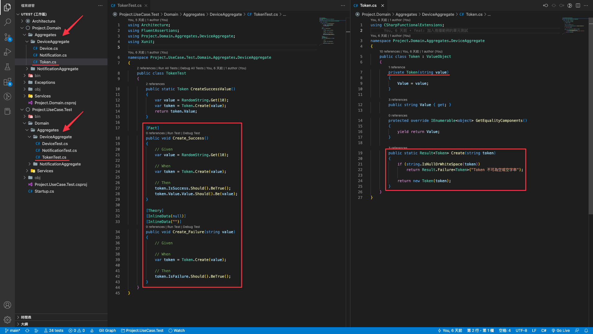

1. Token被設計成Value Object，實作時就會繼承Value Object
2. 建構子被宣告成private，讓Token無法直接透過建構子進行物件生成。
3. 提供Simple Factory的方法來生成Token，並將「不可為空或空字串」的商業邏輯寫在Simple Factory當中。這麼做是確保Token每次創建時，都需要經過Simple Factory中的業務邏輯來判斷資料的正確性。

按照TDD的方式逐項完成塑模後的Domain Model，如下所示：

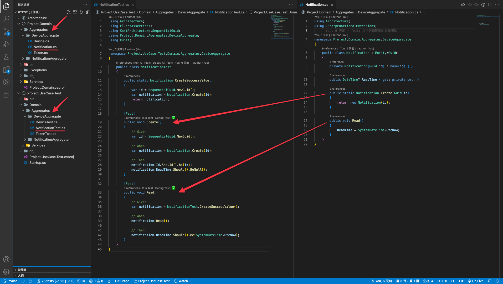
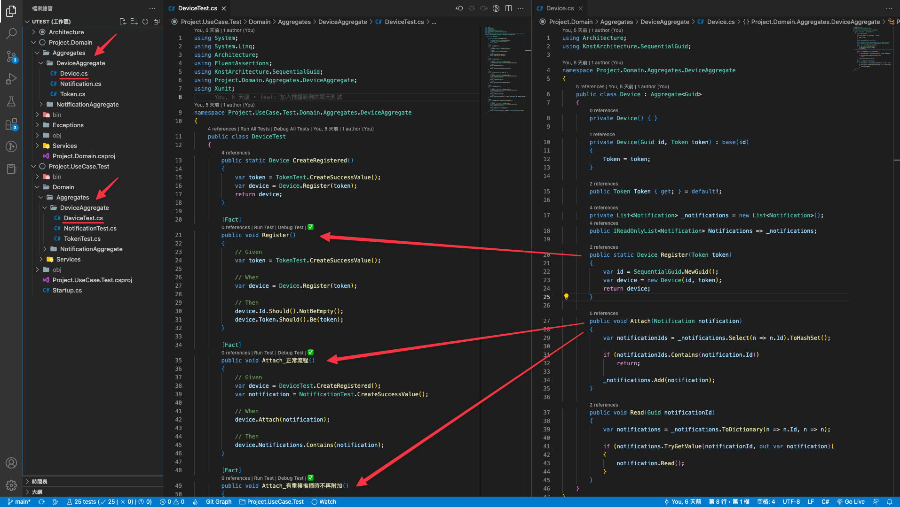

是不是很簡單？Code First + TDD在開發初期不需要特別煩惱Table Schema就可以進行Domain Model的實作，並將商業邏輯封裝在其中。快速失敗、快速驗證，在這個階段遇到問題，就可以馬上在開發團隊中反應。

#### 2. 進行Entity Configurations的設定與Db Migrations
這階段就相當於過去Db First中Table Schema的規劃設計，需要將Domain Model透過Ef.Core映射成Table Schema。

##### Entity Configurations
這邊拿Device(Aggregate)作為例子，會在Infrastructure/EntityConfigurations/DeviceAggregate的目錄下加入Device的Entity Configuration，如下圖所示：

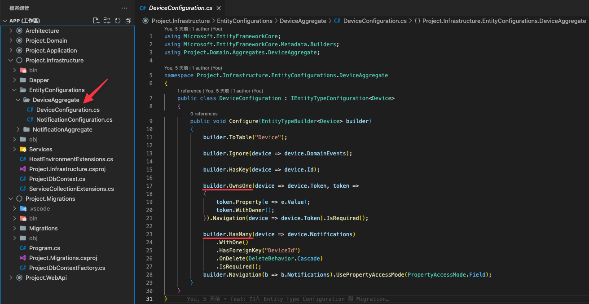

Entity Configuration的設定可以參考[Microsoft的教學](https://learn.microsoft.com/zh-tw/ef/core/modeling/)。

這邊主要特別介紹Owns與Has這兩個差別。
> 概念上被Owns的物件視為無法單獨存在，Aggregate一定要存在才允許被Owns的物件存在，Aggregate消失則被Owns的物件也會隨之消失。**在Find Aggregate時，被Owns的物件也會一同被取出。**
Has的話就沒有那麼強的約束力，Aggregate消失，被Has的物件會依據設定來做對應的行為。在Find Aggregate時，被Has的物件不會一同被取出，需要另外透過[載入相關資料的方式](https://learn.microsoft.com/zh-tw/ef/core/querying/related-data/)。
範例中，Device的Notifications被設定成HasMany，且在OnDelete時設定成一同刪除。其主要是在模擬Owns「Aggregate消失則被Owns的物件也會隨之消失」的特性。並且考量到Device可能擁有幾千個Notifications，如果設定成Owns，每次Find Device都將所有的Notifications取出，會花費太多無意義的資源使用。

結束Device(Aggregate)的設定後，可以看看Device底下Notification(Entity)的設定，如下所示：

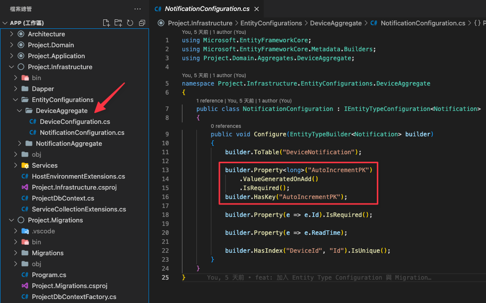

這邊特別注意到有另外加入了「AutoIncreamentPK」這個自動增加的[陰影Primary Key](https://learn.microsoft.com/zh-tw/ef/core/modeling/shadow-properties)。
> 會這麼做的原因是，實作上我們通常只會對Aggregate進行Find、Add、Update、Remove等操作，Aggregate底下的Entity或Value Object完全靠Ef.Core來幫我們進行追蹤，當Entity已經有Id(Primary Key)時，Ef.Core會默認將物件視為Modified，這將導致原本應該Insert的Entity變成執行Update的SQL語法，所以需要一個陰影Primary Key來方便使用Ef.Core進行Model狀態追蹤。

當Entity Configuration設定完之後，即可建立對應的DbContext，如下圖所示：

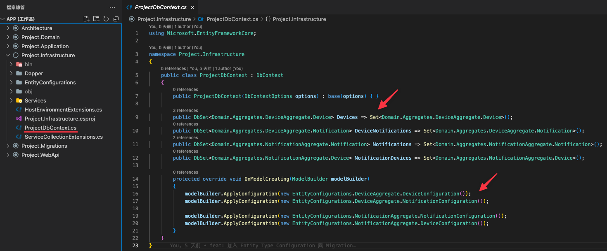

Entity Configuration會套用在OnModelCreating的方法裡面，其對應的Entity會設定成DbContext的Property。

##### Db Migrations
> 在進行Db Migrations階段時，強烈建議在本機透過Docker運行一個虛擬資料庫，使用本機的虛擬資料庫進行開發！

附上Docker執行語法：
```
docker run \
-itd \
--name mysql \
-p 3306:3306 \
-e MYSQL_ROOT_PASSWORD=root \
mysql:5.7
```
Db Migrations基本上可以直接照抄我的範本即可，只需要改變專案名詞，和主要牢記三個[CLI](https://learn.microsoft.com/zh-tw/ef/core/managing-schemas/migrations/?tabs=dotnet-core-cli)：
```
dotnet ef migrations add {name}
dotnet ef migrations remove
dotnet ef database update
```
如果對於CLI不了解怎麼使用，可以加上`-h`來獲取CLI的使用說明。
- `dotnet ef migrations add {name}`會將Entity Configuration的內容輸出成Migration資料夾底下的Migration Class

    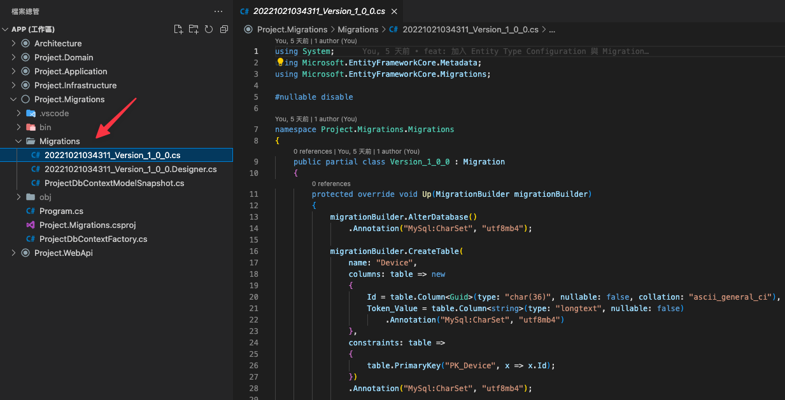

- `dotnet ef migrations remove`則是捨棄最近一次的Migration Class
- `dotnet ef database update`則是將資料庫更新到Migration中最新的狀態

    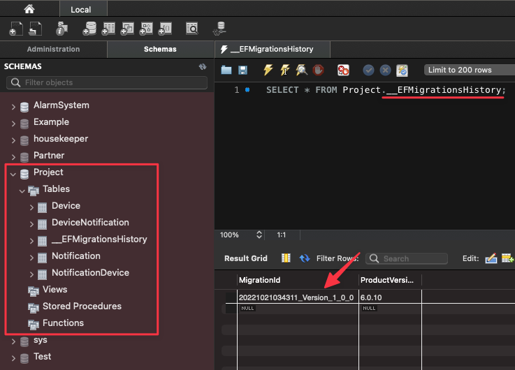

#### 3. 實作WebApi
在實作WebApi階段，請習慣性地將它拆分成 **Command** 與 **Query** 區塊。
- **Command** 指的是會進行資料新增、異動、刪除..等動作
- **Query** 指的是單純資料讀取，不會有任何資料異動

實作主要會關注三個內容：
1. **DTO(Data Transfer Object)** 資料傳輸物件
用於WebApi進行 **Request** 或 **Response** 的物件模型

    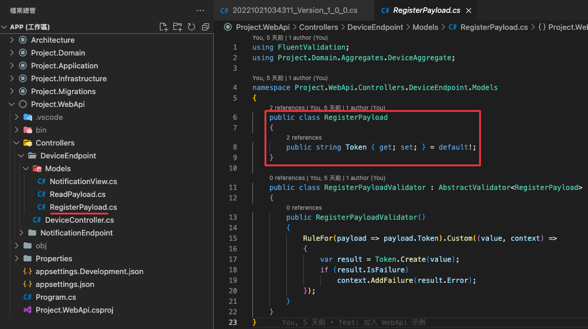

2. **Model Validator** 模型驗證
還記得將商業邏輯封裝在Domain層嗎？這邊拿Token為例子，可以在Validator中透過Token(Value Object)來驗證商業邏輯「不可為空或空字串」的資料正確性。

    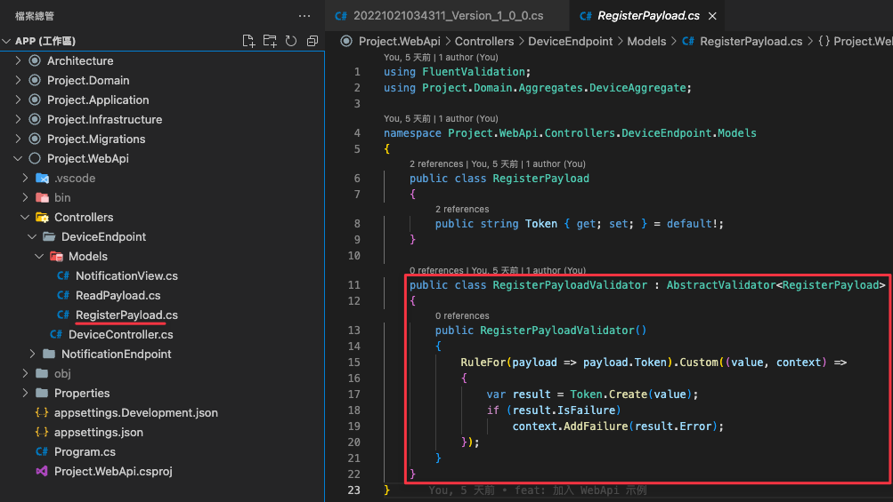

    驗證Request模型失敗會如下圖所示：

    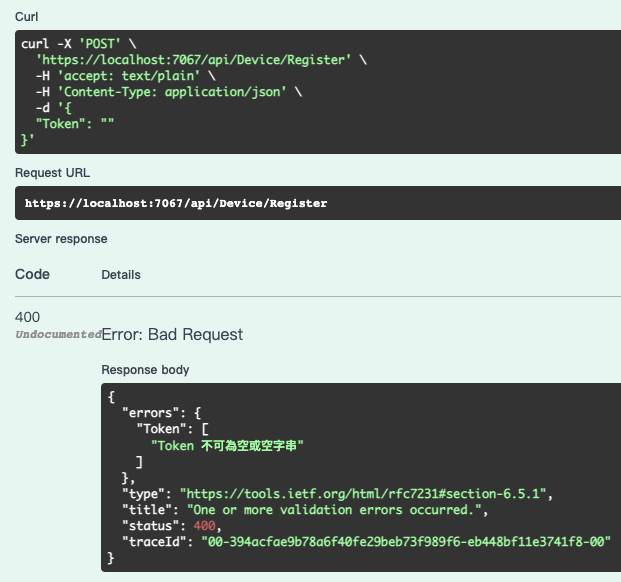

    **DI要記得註冊FluentValidation**
    ```
    builder.Services.AddFluentValidationAutoValidation();
    builder.Services.AddValidatorsFromAssemblies(AppDomain.CurrentDomain.GetAssemblies().Where(p => !p.IsDynamic), ServiceLifetime.Transient);
    ```
3. **Process Flow** 工作流程
    
    Command 的工作流程不外乎是
    - 開啟Transaction
    - 操作Domain Model(Aggregate)的生成方法
    - 進行DbContext的Add/Remove
    - 儲存變更並Commit

        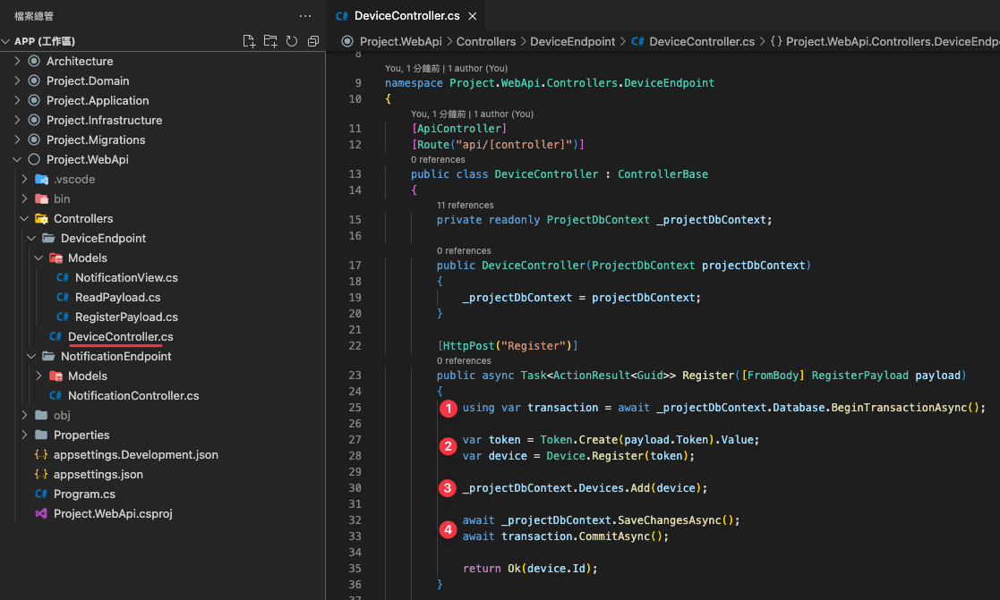

    - 開啟Transaction
    - 取出Domain Model(Aggregate)
    - 操作Domain Model(Aggregate)
    - 儲存變更並Commit

        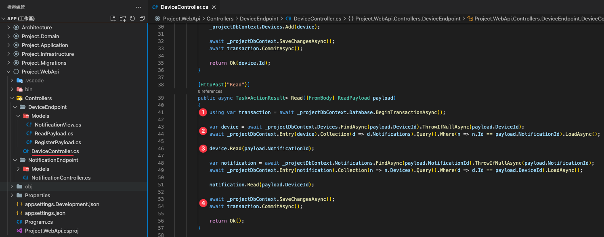

    Query 由於不會涉及到資料操在，所以不會出現系統資料正確性的問題，實作上就更為輕鬆，可以直接透過Sql查詢出來即可。

    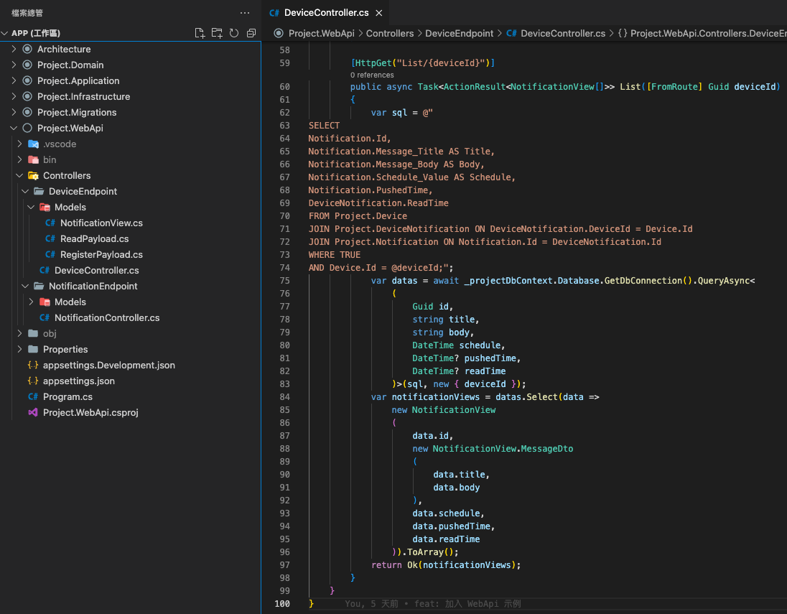

---
## [補充] Domain Service 與 Application Service 的差別
有些人會注意到專案的資料夾架構中有三個Service，包含了Domain Layer的Service、Application Layer的Service、Infrastructure Layer的Service。
大致上可以分成兩類，如下圖所示：

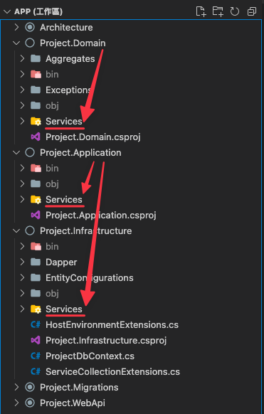

1. **Domain Service**
    
    實作的過程當中，如果發現一些商業邏輯不適合放在Domain Model，就會另外實作在Domain Service中，例如：多個Aggregate的操作，像是帳戶A匯款給帳戶B時，帳戶A-100，帳戶B+100。

    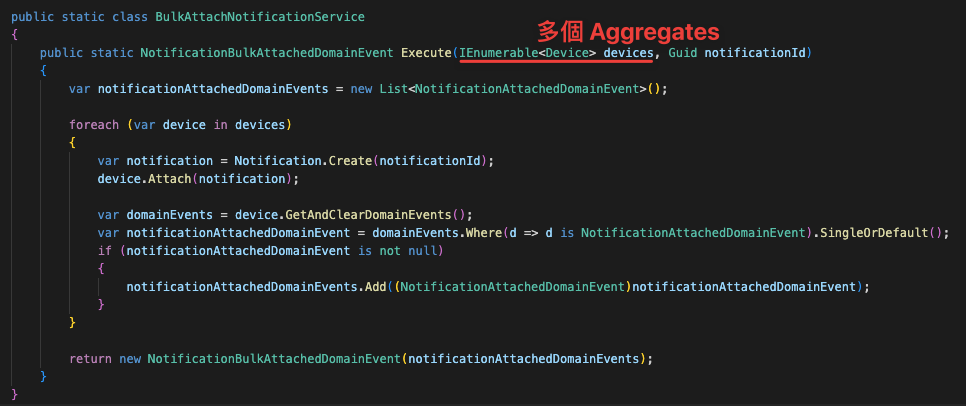

2. **Application Service**
    
    Application Layer的Service是Interface宣告、Infrastructure Layer的Service是Class實作。基本上涉及到IO的都會放在Application Service當中，例如：檔案上傳、外部系統資料取得、外部系統行為操作、特定的資料庫操作..等。
    
    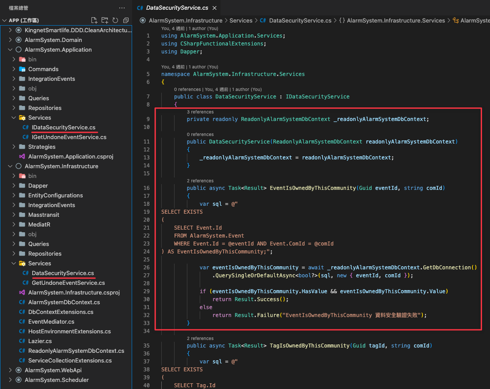

---

## [補充] Clean Architecture

```
Project Root
└ src
  └ * Architecture (基礎的架構建立與宣告)

  └ * Domain
    └ Aggregates (專案的核心，Domain Model與商業邏輯封裝的地方，塑模後的Aggregate會放在這)
    └ Exceptions
    └ Services (此處代表Domain Service的存放處)

  └ * Application
    └ Services (此處代表Application Service的存放處)

  └ * Infrastructure
    └ EntityConfigurations (ORM的配置與設定)

  └ * Migrations (生成Db Migrations的專案)

  └ * WebApi
    └ Controllers (WebApi的Endpoint)

└ test
  └ UseCase.Test
    └ Domain (撰寫Domain Model的Unit Test)
    └ Services (撰寫Domain Service的Unit Test)
```

專案架構的層級由 **高** 至 **低** 為：

0. Architecture
1. Domain
2. Application
3. Infrastructure
4. App (Migrations/WebApi/Test)

**開發時請注意核心原則「低層級可以依賴高層級，高層級不可依賴低層級」**

App (Migrations/WebApi/Test) **可以**依賴 Domain、Application、Infrastructure
Domain **不可以**依賴 Application、Infrastructure、App (Migrations/WebApi/Test)